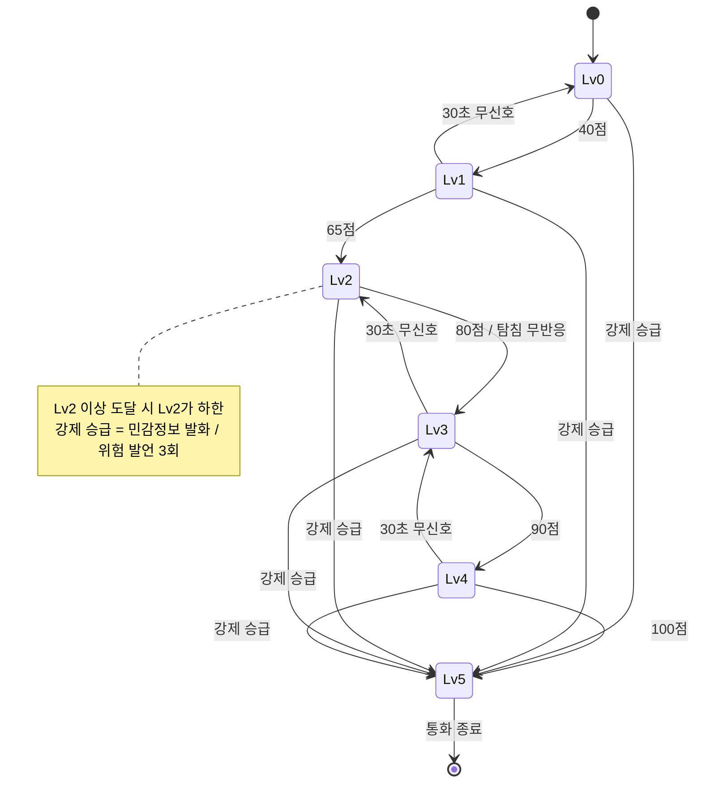

# Lv0~Lv5 에스컬레이션 상태 전이 v1.1

- WBS 1.2.2 / 확정일 2026-09-21
- 점수 규칙은 docs/RISK_WEIGHTS.md (v1.2)를 따른다.

## 레벨

| Lv | 점수 | 개입 | 역할 |
|---|---|---|---|
| 0 | 0–39 | 없음 | 무음 모니터링 |
| 1 | 40–64 | 경고 배너 | 대조군 조건 |
| 2 | 65–79 | 확인 질문 (탐침) | 실사용 고려 짧은 대본 |
| 3 | 80–89 | 거절 문장 (한 호흡에 말할 수 있는 짧은 문장) | 실사용 고려 짧은 대본 |
| 4 | 90–99 | 사기범 발화마다 맥락 기반 반론, 길이 제한 없음 | AI 대본 생성 능력 검증 |
| 5 | 100 또는 강제 승급 | 통화 종료 버튼 + 사후 보호 | 최종 안전장치 |

Lv5 사후 보호는 원터치 신고, 보호자 알림, 재접촉 방어, 지급정지 안내로 설계한다. 논문에는 설계로 제시하고 구현은 논문 제출 이후에 한다.

## 상승

| 조건 | 결과 | 승급 사유 |
|---|---|---|
| 점수가 상위 구간에 진입 (구간 건너뛰기 허용) | 해당 레벨 | `score` |
| Lv2 탐침 발송 후 30초 안에 `yes`·`alternative` 판정 없음 | Lv3 | `timeout` |
| 사용자 민감정보 발화 | 즉시 Lv5 | `sensitive_pattern` |
| 정말 위험한 말 3회 | 즉시 Lv5 | `critical_repeat` |

- 탐침 무반응 승급은 같은 탐침당 1회만 적용한다. 하강으로 Lv2에 돌아온 뒤에는 새 탐침이 나가야 다시 적용된다.
- 강제 승급(sensitive_pattern, critical_repeat)으로 Lv5가 된 경우는 65점 미만이어도 화면을 출력한다.

## 하강

1. 신호 없는 청크가 30초(15청크) 연속이면 한 단계 내려간다.
2. 내려갈 때 점수를 새 레벨의 최저점으로 맞춘다.
3. 한 번이라도 Lv2 이상에 도달한 통화는 Lv2 아래로 내려가지 않는다.
4. Lv5는 내려가지 않는다.

## 탐침 관찰

- 탐침 발송 후 30초 안에 사기범이 검증 질문을 회피하거나 압박을 강화하면 탐침후재압박 +30을 더한다.

## 대본 이행 판정 (script_followed)

- 판정 시간 = 3초 + (대본 글자 수 ÷ 초당 4글자), 2초 단위로 올림, 최소 6초·최대 30초
  - 준비 시간과 말하는 속도는 초기값이며 실험으로 보정한다.

| 값 | 기준 | 점수 반영 |
|---|---|---|
| `yes` | 판정 시간 안에 대본 핵심어 절반 이상 등장 | 없음 |
| `alternative` | 대본과 다르게 거절·종료 의사 표현 | 없음 |
| `no` | 사기범 요구에 응함 | +15 |
| `dismissive` | 무의미·비협조 반응 | 기록만 |

## 세션 종료

| 경로 | 조건 |
|---|---|
| 앱 통보 | 통화 종료 신호 수신 |
| 무청크 타임아웃 | 마지막 청크 후 60초 |
| 세션 상한 | 세션 생성 후 5분 |

## 한계

2폰 구성은 양측 음성이 한 채널에 섞여 들어오고 화자를 분리하지 않는다. 사기범 발화 구분과 대본 이행 판정은 혼합 전사문을 기준으로 LLM이 추정한다.

## 전이도

## 변경 이력

- v1.1 | 2026-09-21 | 청크 2초 반영, 65점 게이트 예외 추가, Lv3 "12자 이내"를 "한 호흡에 말할 수 있는 짧은 문장"으로 변경
